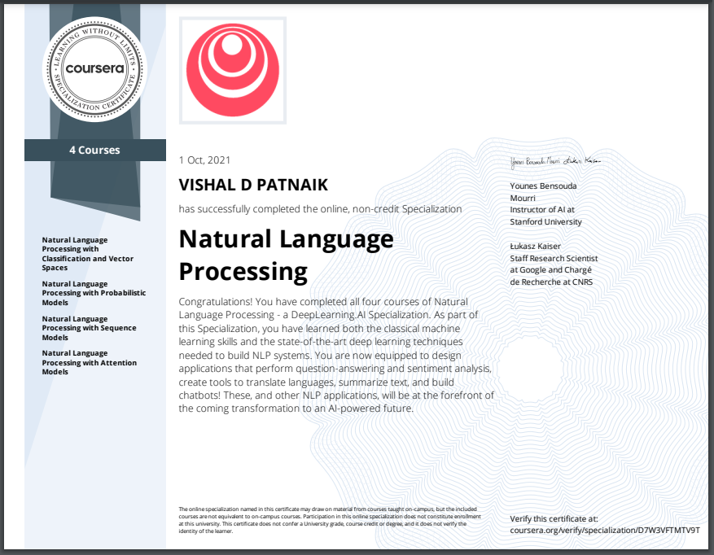

# Natural Language Processing Specialization

## Specialization Completion Certificate

--------------------------------------------------------------------------------

## Classification and Vector Spaces in NLP

* [Week 1 - Logistic Regression for Sentiment Analysis of Tweets](https://github.com/VishalPatnaik/Natural-Language-Processing/tree/main/Natural%20Language%20Processing/1%20Natural%20Language%20Processing%20with%20Classification%20and%20Vector%20Spaces/Week-1)

  Use a simple method to classify positive or negative sentiment in tweets

* [Week 2 - Naïve Bayes for Sentiment Analysis of Tweets](https://github.com/VishalPatnaik/Natural-Language-Processing/tree/main/Natural%20Language%20Processing/1%20Natural%20Language%20Processing%20with%20Classification%20and%20Vector%20Spaces/Week-2)

  Use a more advanced model for sentiment analysis

* [Week 3 - Vector Space Models](https://github.com/VishalPatnaik/Natural-Language-Processing/tree/main/Natural%20Language%20Processing/1%20Natural%20Language%20Processing%20with%20Classification%20and%20Vector%20Spaces/Week-3)

  Use vector space models to discover relationships between words and use principal component analysis (PCA) to reduce the dimensionality of the vector space and visualize those relationships

* [Week 4 - Word Embeddings and Locality Sensitive Hashing for Machine Translation](https://github.com/VishalPatnaik/Natural-Language-Processing/tree/main/Natural%20Language%20Processing/1%20Natural%20Language%20Processing%20with%20Classification%20and%20Vector%20Spaces/Week-4)

  Write a simple English-to-French translation algorithm using pre-computed word embeddings and locality sensitive hashing to relate words via approximate k-nearest neighbors search

## Probabilistic Models in NLP

* [Week 1 - Auto-correct using Minimum Edit Distance](https://github.com/VishalPatnaik/Natural-Language-Processing/tree/main/Natural%20Language%20Processing/2%20Natural%20Language%20Processing%20with%20Probabilistic%20Models/Week-1)

  Create a simple auto-correct algorithm using minimum edit distance and dynamic programming

* [Week 2 - Part-of-Speech (POS) Tagging](https://github.com/VishalPatnaik/Natural-Language-Processing/tree/main/Natural%20Language%20Processing/2%20Natural%20Language%20Processing%20with%20Probabilistic%20Models/Week-2)

  Apply the Viterbi algorithm for POS tagging, which is important for computational linguistics

* [Week 3 - N-gram Language Models](https://github.com/VishalPatnaik/Natural-Language-Processing/tree/main/Natural%20Language%20Processing/2%20Natural%20Language%20Processing%20with%20Probabilistic%20Models/Week-3)

  Write a better auto-complete algorithm using an N-gram model (similar models are used for translation, determining the author of a text, and speech recognition)

* [Week 4 - Word2Vec and Stochastic Gradient Descent](https://github.com/VishalPatnaik/Natural-Language-Processing/tree/main/Natural%20Language%20Processing/2%20Natural%20Language%20Processing%20with%20Probabilistic%20Models/Week-4)

  Write your own Word2Vec model that uses a neural network to compute word embeddings using a continuous bag-of-words model

## Sequence Models in NLP

* [Week 1 - Sentiment with Neural Nets](https://github.com/VishalPatnaik/Natural-Language-Processing/tree/main/Natural%20Language%20Processing/3%20Natural%20Language%20Processing%20with%20Sequence%20Models/Week-1)

  Train a neural network with GLoVe word embeddings to perform sentiment analysis of tweets

* [Week 2 - Language Generation Models](https://github.com/VishalPatnaik/Natural-Language-Processing/tree/main/Natural%20Language%20Processing/3%20Natural%20Language%20Processing%20with%20Sequence%20Models/Week-2)

  Generate synthetic Shakespeare text using a Gated Recurrent Unit (GRU) language model

* [Week 3 - Named Entity Recognition (NER)](https://github.com/VishalPatnaik/Natural-Language-Processing/tree/main/Natural%20Language%20Processing/3%20Natural%20Language%20Processing%20with%20Sequence%20Models/Week-3)

  Train a recurrent neural network to perform NER using LSTMs with linear layers

* [Week 4 - Siamese Networks](https://github.com/VishalPatnaik/Natural-Language-Processing/tree/main/Natural%20Language%20Processing/3%20Natural%20Language%20Processing%20with%20Sequence%20Models/Week-4)

  Use so-called ‘Siamese’ LSTM models to compare questions in a corpus and identify those that are worded differently but have the same meaning

## Attention Models in NLP

* [Week 1 - Neural Machine Translation with Attention](https://github.com/VishalPatnaik/Natural-Language-Processing/tree/main/Natural%20Language%20Processing/4%20Natural%20Language%20Processing%20with%20Attention%20Models/Week-1)

  Translate complete English sentences into French using an encoder/decoder attention model

* [Week 2 - Summarization with Transformer Models](https://github.com/VishalPatnaik/Natural-Language-Processing/tree/main/Natural%20Language%20Processing/4%20Natural%20Language%20Processing%20with%20Attention%20Models/Week-2)

  Build a transformer model to summarize text

* [Week 3 - Question-Answering with Transformer Models](https://github.com/VishalPatnaik/Natural-Language-Processing/tree/main/Natural%20Language%20Processing/4%20Natural%20Language%20Processing%20with%20Attention%20Models/Week-3)

  Use T5 and BERT models to perform question answering

* [Week 4 - Chatbots with a Reformer Model](https://github.com/VishalPatnaik/Natural-Language-Processing/tree/main/Natural%20Language%20Processing/4%20Natural%20Language%20Processing%20with%20Attention%20Models/Week-4)

  Build a chatbot using a reformer model

--------------------------------------------------------------------------------

### Author
Viahal Patnaik/ [@VISHAL](https://github.com/VishalPatnaik)
